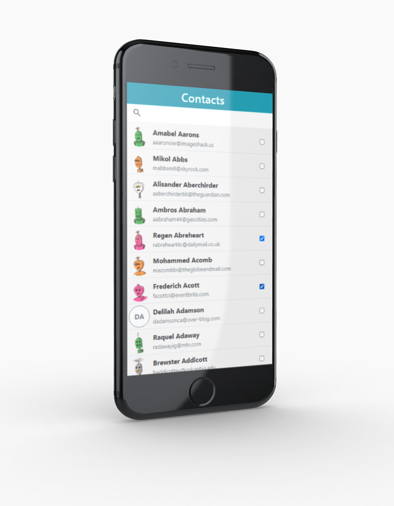

# Contacts

A project that shows a list of contacts in alphabetical order fetched from external API. This is a Progressive Web Application which means it is intended to work on any platform that uses a standards-compliant browser, including both desktop and mobile devices. In the application, you can search for contacts by first and last name and you can also select them by using checkboxes.

<p align="center">
  
</p>

## Tech/framework

| Tech                                          | Description                          |
| --------------------------------------------- | ------------------------------------ |
| [React](https://reactjs.org/)                 | Library for building user interfaces |
| [Typescript](https://www.typescriptlang.org/) | Javascript superset language         |
| [Bootstrap](https://getbootstrap.com/)        | UI library                           |
| [Prettier](https://prettier.io/)              | Code formatter                       |

## Installation

```bash

git clone https://github.com/eszczepan/Contacts

npm install

npm run start

```

## Available scripts

| Command         | Description            |
| --------------- | ---------------------- |
| `npm run start` | Open local server      |
| `npm run build` | Create optimized build |
| `npm run test`  | Run tests              |
| `npm run eject` | Eject CRA              |
